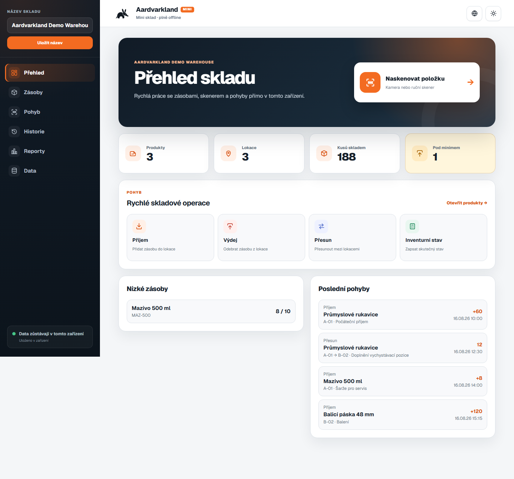
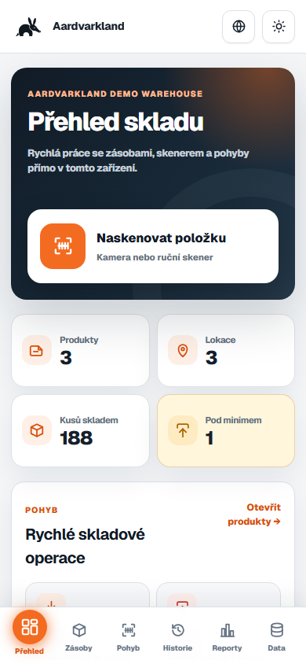
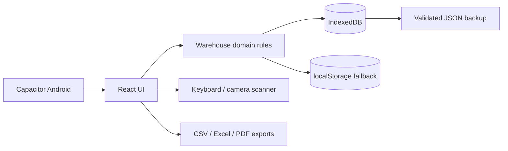

# Aardvarkland WMS Mini

A lightweight offline-first open-source warehouse management system for one warehouse and one device.

[Live Demo](https://maxmilianbaron.github.io/Aardvarkland-WMS-Mini/) · [Screenshots](#screenshots) · [Quick Start](#quick-start) · [Android](ANDROID.md) · [Full WMS](https://github.com/MaxmilianBaron/Aardvarkland-WMS)

 

## Overview

WMS Mini is a local-first React/Vite PWA and Capacitor Android app. IndexedDB is the source of truth, so products, locations, stock, movements, and backups remain on the device without a server account or hidden cloud synchronization.

## Why this project?

- Start a small warehouse without deploying a backend or database server.
- Continue core stock operations offline after the first successful load.
- Use barcode input, batch and expiry tracking, reports, and backups from one device.
- Install the same code as a PWA or package it for Android.
- Keep full control of the source and local data.

## Features

- Products, categories, locations, minimum stock, barcodes, batches, and expiries
- Receiving, issuing, moving, counting, and append-only movement history
- Keyboard-wedge and camera barcode scanning
- Validated CSV/XLSX import and Excel, CSV, and PDF exports
- IndexedDB storage with localStorage fallback and versioned migrations
- Validated JSON backup and restore
- Optional local PIN lock using salted PBKDF2
- Czech, English, Ukrainian, French, German, and Spanish interfaces
- PWA installation and Capacitor Android project

## Screenshots

| Desktop warehouse overview | Mobile workflow |
| --- | --- |
|  |  |

## Live Demo

Open the [interactive WMS Mini demo](https://maxmilianbaron.github.io/Aardvarkland-WMS-Mini/). Demo data is stored only in your browser profile and can be reset or exported from the app.

## Quick Start

Requires Node.js 24.15+ and npm 11.12+.

```bash
git clone https://github.com/MaxmilianBaron/Aardvarkland-WMS-Mini.git
cd Aardvarkland-WMS-Mini
npm ci
npm run dev
```

Open `http://localhost:4010`.

## Installation

For an optimized local build:

```bash
npm ci
npm run build
npm run preview
```

Install the PWA from the browser address bar. Regularly export a JSON backup and store it outside the device.

## Configuration

WMS Mini has no backend credentials or cloud configuration. Android metadata lives in `capacitor.config.ts` and `android/`. Production Android signing must be configured outside the repository.

## Development

```bash
npm run dev
npm run typecheck
```

The development and preview server use port `4010`.

## Testing

```bash
npm run typecheck
npm test
npm run build
```

Browser and device tests are separate from the automated source checks. Camera, PWA installation, Android packaging, and data retention should be verified on the target device.

## Building

```bash
npm run build
npm run android:sync
npm run android:debug
```

See [ANDROID.md](ANDROID.md) for Android SDK requirements and release boundaries.

## Architecture



No server, account system, central synchronization, ERP integration, or shared multi-device database is included.

## Project Structure

- `src/` — React UI, domain rules, storage, security, backup, and localization
- `public/` — PWA manifest, service worker, icons, fonts, and screenshots
- `scripts/` — executable contract and behavior tests
- `e2e/` — browser UI scenarios
- `android/` — Capacitor Android wrapper

## Roadmap

- Improve import mapping and error explanations
- Expand accessibility and device coverage
- Add optional user-controlled synchronization adapters without weakening local-first operation
- Publish reproducible signed release guidance

## Contributing

See [CONTRIBUTING.md](CONTRIBUTING.md).

## Security

See [SECURITY.md](SECURITY.md) for private vulnerability reporting. Do not attach real warehouse exports to public issues.

## Related Projects

Need a central multi-user platform? See [Aardvarkland WMS](https://github.com/MaxmilianBaron/Aardvarkland-WMS). Another Aardvarkland open-source project is [CashTally](https://github.com/MaxmilianBaron/Aardvarkland-CashTally).

## License

Licensed under the [MIT License](LICENSE).

If you find this project useful, consider giving it a star — it helps others discover the project.
